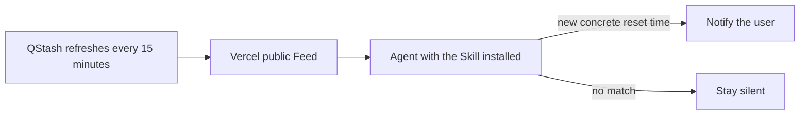

# ⏰ Tibo Reset Reminder

> Stop refreshing X. When Tibo announces when Codex quota will reset, your Agent tells you.

✅ Agent Skill · 🔑 No X API token · 🆓 Free public Feed · ⏱️ Checks every 15 minutes · 🔕 Silent by default

[中文](README.md) · [Live Feed](https://tibo-reset-reminder-skill.vercel.app/api/feed) · [Service health](https://tibo-reset-reminder-skill.vercel.app/api/health)

## Install in 30 seconds

Send this complete prompt to an Agent that supports Agent Skills and scheduled tasks:

```text
Install tibo-reset-reminder-skill from https://github.com/orange90/tibo_reset_reminder_skill. First summarize how many distinct Codex quota resets Tibo (@thsottiaux) mentioned during the past 7 days, then check every 15 minutes. Notify me only when a new post gives concrete reset timing, with a short summary and source permalink. Use the project's public Feed and do not ask me for an X API token.
```

The host may request permission to create a scheduled task. That is expected. You can grant one-time approval first and verify the interval and notification target before allowing it permanently.

## What happens after installation

1. **Immediate recap**: review the available seven-day history and group multiple posts about the same reset into one event.
2. **Quiet monitoring**: run every five minutes and say nothing when there is no new actionable information.
3. **Useful alerts**: notify only when Tibo provides a date, relative time, recurring schedule, or another concrete reset time.

```text
Initial scan complete: Tibo clearly reported 2 distinct Codex quota resets in the past 7 days.
July 25 — Weekly quota reset completed — source link
July 28 — Rolling quota reset completed — source link
I will now check every 5 minutes and stay silent unless new reset information appears.
```

If the public Feed has not yet accumulated seven continuous days, the recap explicitly says “at least N within the currently verifiable period” instead of presenting partial data as a complete total.

## The kind of alert you receive

```text
⏰ Tibo posted a Codex quota update

He says: Codex weekly usage will be restored in two hours.
Expected reset: today at 18:00 local time
Source: https://x.com/thsottiaux/status/...
```

Vague statements such as “soon” or “we are working on it” do not trigger an alert. If the reset is not imminent, the Agent uses accurate wording such as “will reset on Monday.”

## Why use it

- **No X API setup**: installations read the project-maintained public Feed without an X login or token.
- **Not a keyword firehose**: a post must concern Codex quota and contain actionable timing.
- **No duplicate alerts**: post IDs and text hashes prevent repeats while edited posts are reconsidered.
- **Useful from the first run**: receive a recent reset recap before quiet monitoring begins.
- **Localized notifications**: use the user's explicit preference, host locale, or conversation language.

## Agent compatibility

The Skill follows the common Agent Skills directory format. Continuous five-minute checks require the host to provide an Automation, Scheduled Task, or Cronjob capability.

| Host | Skill support | Scheduling | Notes |
| --- | --- | --- | --- |
| Codex | Agent Skills | Automation or system scheduler | Scheduling depends on the runtime |
| Claude Code | Agent Skills | Plugin or system scheduler | Scheduling depends on the host |
| Hermes | Agent Skills | Cronjob | Requests approval when creating the task |
| Cursor, OpenCode, and others | Works when Agent Skills are supported | Host-provided | Confirm persistent state and scheduling support |

The Skill performs one check per invocation. It cannot keep its own background process alive; the host owns the timer.

## How it works



The central service reads and verifies Tibo's public X content, then caches normalized results in a read-only Feed. Individual installations consume that Feed rather than scraping X or falling back to Google Cache, search snippets, or arbitrary public proxies.

## FAQ

### Do end users pay or configure a token?

No. The project operates the public Feed. End users do not configure an X API token, Vercel, or Upstash.

### Why does installation ask for cronjob permission?

The installation prompt asks the host to create a persistent scheduled task. The Skill files do not grant themselves background access. Review the task with one-time approval before granting permanent approval.

### Why have I received no messages?

That is usually expected. When no new post qualifies, the Skill returns `NO_REPLY`, which the host should suppress. Check [service health](https://tibo-reset-reminder-skill.vercel.app/api/health) if you suspect an outage.

### Does the public Feed receive my chats or notification details?

No. It serves verified public-post data and does not receive user conversations or notification targets. The host Agent manages notification delivery and local deduplication state.

More help is available in [`docs/troubleshooting.md`](docs/troubleshooting.md).

## Manual installation

Clone the repository into the Skills directory used by your host and register the directory as `tibo-reset-reminder-skill`:

```bash
git clone https://github.com/orange90/tibo_reset_reminder_skill.git tibo-reset-reminder-skill
```

Ask the Agent to read `SKILL.md`, perform the initial scan once, then follow [`references/scheduling.md`](references/scheduling.md) to create the recurring task.

## Maintainers and developers

- [Public Feed architecture](docs/architecture.md)
- [Free self-hosting guide](docs/self-hosting.md)
- [Scheduling reference](references/scheduling.md)
- [Troubleshooting](docs/troubleshooting.md)
- [Skill instructions](SKILL.md)

Run the checks:

```bash
npm test
python3 -m py_compile scripts/fetch_x_posts.py scripts/state_store.py
```

This project currently has no declared open-source license. Do not assume permission to copy, modify, or redistribute the code until the maintainer selects one.
