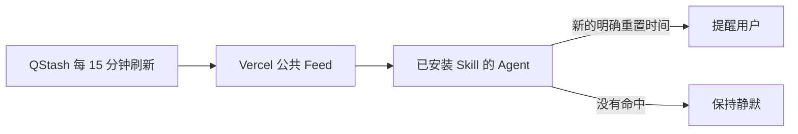

# ⏰ Tibo Reset Reminder

[English](README.en.md) 

> 不用再反复刷新 X。Tibo 一公布 Codex 额度重置时间，你的 Agent 就会提醒你。

✅ Agent Skill · 🔑 无需 X API Token · 🆓 免费公共 Feed · ⏱️ 每 15 分钟检查 · 🔕 未命中就静默

· [查看实时 Feed](https://tibo-reset-reminder-skill.vercel.app/api/feed) · [查看服务状态](https://tibo-reset-reminder-skill.vercel.app/api/health)

## 30 秒安装

把下面这句话完整发送给支持 Agent Skills 和定时任务的 Agent：

```text
请从 https://github.com/orange90/tibo_reset_reminder_skill 安装 tibo-reset-reminder-skill。安装后先总结 Tibo（@thsottiaux）最近 7 天提到的 Codex 额度重置次数，然后每 15 分钟检查一次；只有发现新的、明确的重置时间时才提醒我，并附上内容摘要和原帖链接。使用项目提供的公共 Feed，不要向我索要 X API Token。
```

安装时，宿主可能会请求创建定时任务的权限。这是正常行为；你可以先选择单次授权，核对频率和通知对象后再决定是否永久授权。

## 安装后会发生什么

1. **立即回顾**：检查当前可用的最近 7 天记录，把同一次重置的多条更新合并后告诉你实际重置了几次。
2. **安静监控**：之后每 15 分钟运行一次，没有新的明确信息就保持静默。
3. **及时提醒**：只有当 Tibo 给出日期、相对时间或固定周期等可执行时间时，才发送摘要和原帖链接。

```text
首次扫描完成：过去 7 天，Tibo 明确提到 Codex 额度重置共 2 次。
7 月 2 日 — 每周额度完成重置 — 原帖链接
7 月 28 日 — 滚动额度完成重置 — 原帖链接
接下来我会每  分钟检查一次；没有新的重置信息时不会打扰你。
```

公共 Feed 尚未积累满 7 天连续历史时，首次总结会明确写成“当前可核验范围内至少 N 次”，不会把不完整数据冒充完整统计。

## 你只会收到这样的提醒

```text
⏰ Tibo 更新了 Codex 额度信息

他说：Codex 的每周额度将在两小时后恢复。
预计重置：今天 18:00（北京时间）
原帖：https://x.com/thsottiaux/status/...
```

如果原帖只说“很快”或“我们正在处理”，不会触发提醒。如果重置并不临近，Agent 会使用“将在周一重置”等准确表述，而不是机械地说“马上”。

## 为什么用它

- **不用申请 X API**：所有安装用户读取项目维护的公共 Feed，无需登录 X 或配置 Token。
- **不是关键词轰炸**：必须同时与 Codex 额度有关，并包含明确或可执行的时间信息。
- **不会重复提醒**：使用帖子 ID 和文本哈希去重，编辑后的帖子会重新判断。
- **首次运行就有结果**：先总结最近一周的重置事件，再进入静默监控。
- **跟随用户语言**：优先使用用户指定、系统或当前对话的语言发送提醒。

## 支持哪些 Agent

Skill 遵循通用的 Agent Skills 目录格式。能否持续每  分钟运行，取决于宿主是否提供 Automation、Scheduled Task 或 Cronjob。

| 宿主 | 读取 Skill | 定时检查 | 说明 |
| --- | --- | --- | --- |
| Codex | Agent Skills | Automation 或系统调度 | 定时能力取决于运行环境 |
| Claude Code | Agent Skills | 插件或系统调度 | 定时能力取决于宿主 |
| Hermes | Agent Skills | Cronjob | 创建任务时会请求用户授权 |
| Cursor、OpenCode 等 | 兼容 Agent Skills 时可用 | 由宿主提供 | 安装前确认宿主支持持久化状态和定时任务 |

Skill 每次只完成一次检查，不能让自己的进程永久驻留。真正的定时器由宿主负责创建。

## 工作原理



中心服务统一读取并核验 Tibo 的公开 X 内容，再把标准化结果缓存到只读 Feed。每位用户的 Agent 只需读取 Feed，不会各自抓取 X，也不会使用 Google Cache、搜索结果片段或任意公共代理。

## 常见问题

### 普通用户需要付费或设置 Token 吗？

不需要。公共 Feed 由项目统一维护，最终用户无需配置 X API Token、Vercel 或 Upstash。

### 为什么安装时会请求 cronjob 权限？

因为“一句话安装”要求宿主创建持续运行的定时任务。Skill 文件本身不会自行获得后台权限。建议先单次授权并检查任务内容。

### 为什么安装后一直没有消息？

这通常是正常的：没有新的明确重置时间时，Skill 会输出 `NO_REPLY`，宿主应抑制这条结果。如果怀疑服务异常，可以查看[服务状态](https://tibo-reset-reminder-skill.vercel.app/api/health)。

### 会把我的聊天或通知信息上传到公共 Feed 吗？

不会。公共 Feed 只提供经过核验的公开帖子数据，不接收用户的聊天内容或通知目标；提醒渠道和本地去重状态由宿主 Agent 管理。

### 已经安装旧版本，怎么手动运行一周总结？

```text
请用 $tibo-reset-reminder-skill 总结 Tibo 最近 7 天提到的 Codex 额度重置，按实际重置事件去重计数，并附上摘要和原帖链接；不要修改现有定时任务。
```

更多排障信息见 [`docs/troubleshooting.md`](docs/troubleshooting.md)。

## 手动安装

将仓库克隆到宿主使用的 Skills 目录，并把技能目录注册为 `tibo-reset-reminder-skill`：

```bash
git clone https://github.com/orange90/tibo_reset_reminder_skill.git tibo-reset-reminder-skill
```

然后让 Agent 读取 `SKILL.md`，先运行一次首次扫描，再参考 [`references/scheduling.md`](references/scheduling.md) 创建定时任务。

## 维护者与开发者

- [公共 Feed 架构](docs/architecture.md)
- [免费自部署指南](docs/self-hosting.md)
- [调度参考](references/scheduling.md)
- [排障指南](docs/troubleshooting.md)
- [Skill 指令](SKILL.md)

运行测试：

```bash
npm test
python3 -m py_compile scripts/fetch_x_posts.py scripts/state_store.py
```

项目目前未声明开源许可证。在维护者选择许可证之前，请不要假定代码可以被任意复制、修改或再发布。
